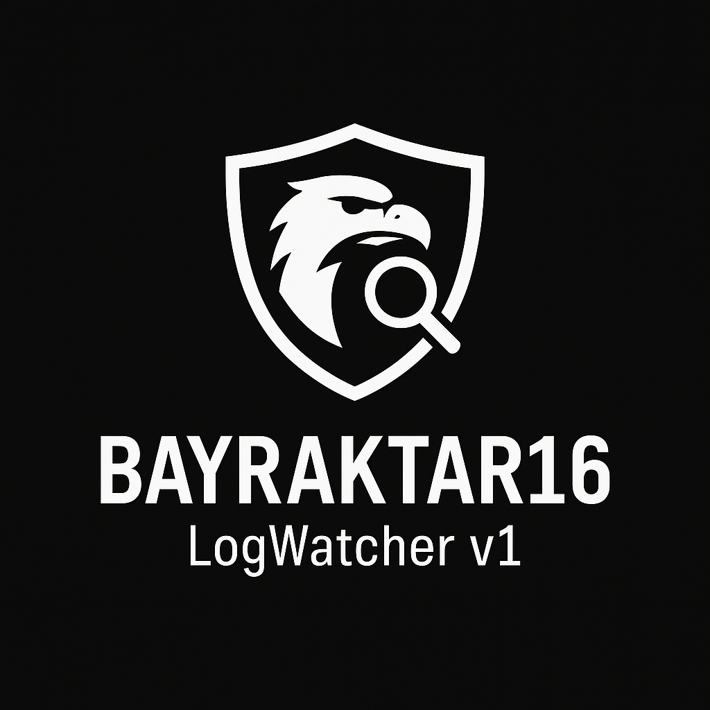

<p align="center">
  
</p>
# BAYRAKTAR16 – LogWatcher v1

**"Sistemi koruyan göz, sessiz çalışır."**

Bayraktar16 LogWatcher, basit ama güçlü bir log analiz aracıdır.
Sistem loglarını tarayarak şüpheli IP adreslerini, hata mesajlarını ve tarih bazlı giriş yoğunluklarını listeler.

## Özellikler:
- Failed login ve invalid giriş tespiti
- En sık gelen IP adreslerini sıralama
- Hatalı giriş mesajlarının analizi
- Tarih bazlı giriş frekans raporu
- Bash tabanlı, hızlı ve taşınabilir

## Kullanım:

```bash
chmod +x logwatcher.sh
./logwatcher.sh /var/log/auth.log
```

## Lisans

Bu proje MIT lisansı ile sunulmuştur.

## Ait Olduğu Duruş:

> **“Bilginin ışığında yürürüm, sessizliğin içinde duyarım”
> BAYRAKTAR16 - Sancak Muhafızları**
> 
